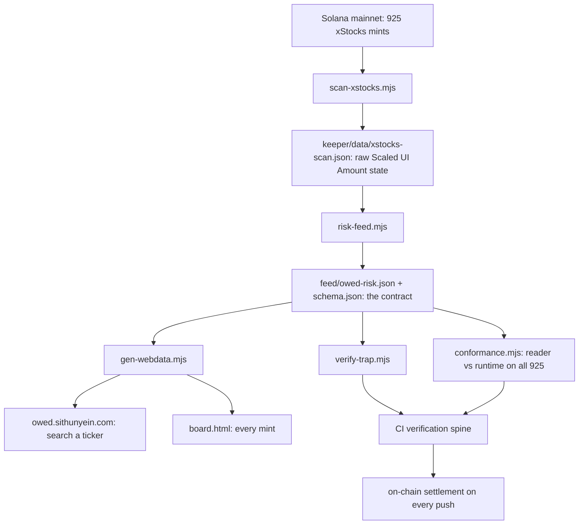
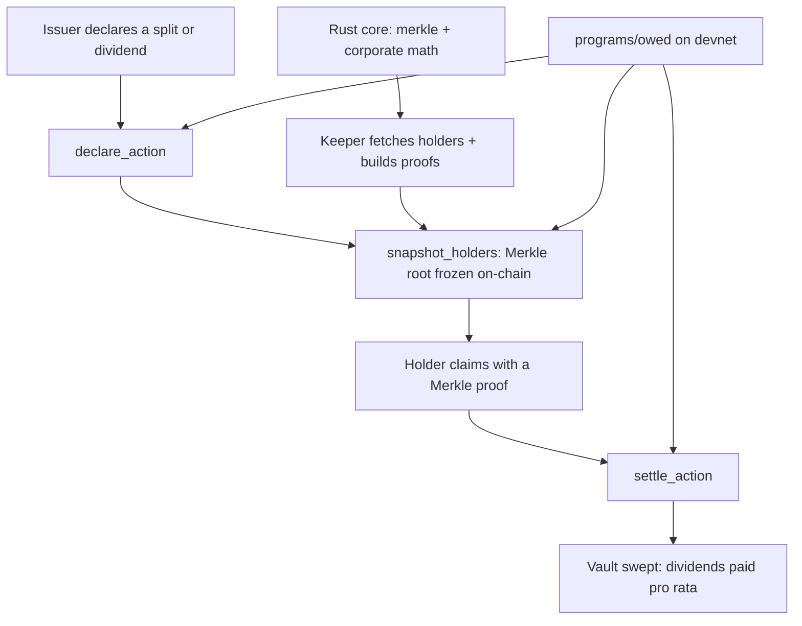

<p align="center">
  <picture>
    <source media="(prefers-color-scheme: dark)" srcset="web/assets/logo-white.png" />
    
  </picture>
</p>

# Owed - corporate-actions risk for tokenized equities on Solana

<p align="center">
  <a href="https://owed.sithunyein.com">Live app</a> ·
  <a href="https://owed.sithunyein.com/feed/owed-risk.json">Risk feed</a> ·
  <a href="https://owed.sithunyein.com/board.html">Risk board</a> ·
  <a href="https://github.com/thesithunyein/owed/actions/workflows/ci.yml">CI</a> ·
  <a href="CONTRIBUTING.md">Contributing</a> ·
  <a href="CODE_OF_CONDUCT.md">Conduct</a> ·
  <a href="SECURITY.md">Security</a> ·
  <a href="LICENSE">MIT</a>
</p>

<p align="center">
  <a href="https://github.com/thesithunyein/owed/actions/workflows/ci.yml"></a>
  
  
  
  <a href="SECURITY.md"></a>
</p>

<p align="center">
  <em>Splits and dividends rebase tokenized stocks on-chain. The on-chain field most apps read goes stale.
  Owed measures the gap, publishes it as an auditable feed, and settles corporate actions correctly on-chain.</em>
</p>

<!-- owed:stats:start -->
> **379 of 925 official xStocks carry a stale on-chain multiplier field**
> (classified at 2026-09-22 15:49 UTC); 4 are off by 100% or more, and 2 by a full 10x.
> Not in theory: every mint was scanned and the effective value read from the chain.
<!-- owed:stats:end -->

## Architecture

The pipeline that turns mainnet state into a published, checkable answer:



The on-chain registry that settles corporate actions correctly, once price
discovery on the stale field is done:



Devnet program: `42WwVtPQzKiQRtDvaiGM7yjMw8jPSN1hxam24FcFFCLV` (split and
dividend settled end-to-end; signatures in "Devnet deployment" below).

CI runs the full verification spine on every push: Rust tests, 75 keeper tests,
925/925 conformance against the runtime, deterministic rebuild, program-id
agreement across four sources, ELF e_flags, an on-chain settlement with
receipts, and re-checking every page/README claim against committed records.

The invariant that holds the whole thing together: **every published number is
recomputable from published inputs.** The feed ships the raw chain state beside
its answer; the pages re-classify at your clock; CI fails if a README number, a
cited signature, and the committed record ever disagree.

## What we found (live mainnet snapshot)

xStocks (Backed Finance) rebases dividends and splits through the Token-2022
**Scaled UI Amount** extension. The extension stores `multiplier` plus a pending
change with an activation timestamp. The field is **not self-maintaining**: after
an activation passes, the stored `multiplier` keeps the old value until the issuer
overwrites it, while the *effective* multiplier is time-dependent:

```
effective(now) = now >= newMultiplierEffectiveTimestamp ? newMultiplier : multiplier
```

An app that reads the stored field alone - the obvious integration - computes the
wrong price for every affected token. Our full scan of the official mint list:

| Finding | Count |
|---|---|
<!-- owed:table:start -->
| Official xStocks Solana mints scanned | **925** |
| **Reader traps** (activation passed, stored field stale) | **379** |
| … off by **10x** (10-for-1 splits) | **2** (`PPLTx`, `NFLXx`) |
| … off by **≥100%** | **4** |
| … off by **≥1%** | **28** |
| … off by **≥0.5%** | **110** |
| Median magnitude of the gap | **0.32%** |
| Median time already stale | **29 days** |
| Longest stale | **349 days** (`GMEx`) |
| Mints with a **permanent delegate** (issuer can move anyone's tokens) | **925 / 925** |
| Mints with a **pause authority** (issuer can freeze all transfers) | **925 / 925** |
| Currently paused | 0 |
<!-- owed:table:end -->

Most gaps are small - and saying so is the point. `AAPLx` (`XsbEhL…zJp`) has
stored `1.00266…` while `1.00327…` took effect on **2026-08-07**, a 0.06% error.
But the tail is not small: `NFLXx` still carries a stored `1.0` while the chain
applies **10**, 309 days after the split activated. Anyone valuing an `NFLXx`
position from that field is wrong by an order of magnitude, and it has been wrong
since November 2025.

**Precise scope of the claim** (it is falsifiable, so state it precisely): this
traps apps that read `scaledUiAmountConfig.multiplier` from the mint account - the
obvious integration when you cache token config, build an indexer, or value
collateral. Apps that call `getTokenSupply` / `amountToUiAmount` get the correct
effective value from the runtime and are unaffected.

**How the assumption was verified, not assumed.** The whole thesis depends on
Token-2022 applying the pending multiplier automatically once its timestamp
passes. `scripts/verify-trap.mjs` tests that against mainnet instead of reasoning
about it: `getTokenSupply` reports the runtime's effective scaled amount, so the
ratio `uiAmount / rawAmount` is ground truth. Result: **8 of 8 sampled traps match
the pending multiplier, not the stored one** - including `NFLXx` at exactly `10`.

```
node scripts/verify-trap.mjs            # worst offenders, auto-selected
node scripts/verify-trap.mjs AAPLx NFLXx
```

### The reader is verified against the runtime, not just argued for

`scripts/conformance.mjs` checks our rule against the chain mint by mint:
`getTokenSupply` reports the runtime's effective scaled amount, so the ratio it
returns is ground truth.

```
$ node scripts/conformance.mjs --all
924/924 mints match the Token-2022 runtime (tolerance 1e-9), 1 not checked
                          # ARx hit a transient HTTP 403 mid-sweep;
                          # `--only ARx` retried it clean: 1/1
```

That is the **entire official xStocks set - 925 of 925 mints - with our reader
agreeing with the runtime to nine decimal places.** The default `--n` sample is
stratified (every mint with a real gap is included, then the rest filled from
fresh mints), so a pass cannot be earned by only testing mints where the two
readings trivially agree.

### Why this is a settlement bug, not a display bug

`scripts/collateral-scenario.mjs` models the consequence without a price feed: a
valuation is `raw × multiplier × price`, so price and position size cancel out of
the error entirely. What is left is a multiplier ratio, and a loan-to-value is
inflated by exactly that ratio.

| Position genuinely at 10% LTV, 75% liquidation threshold | Outcome |
|---|---|
| The mints at 10× | reads as **100% LTV** → liquidated while healthy |
| Mints in the 2–5× range | reads 20–50% → wrong, not liquidatable |
| Median across the mispriced set | under 1% → immaterial |

**Only the handful at 10× would liquidate a position that is genuinely at 10% LTV.**
Not the whole mispriced set. The rest are wrong in a way that has not yet cost
anyone money, and saying so is the difference between a finding and a sales pitch.
The exact counts are generated above from the published feed, never typed by hand.

And the security surface nobody markets: **every official xStock carries a
permanent delegate and a pause authority.** One compromised issuer key can
confiscate or freeze any holder's balance. Presence is not an attack - but any
protocol integrating these tokens as collateral must know, and none of it is
visible in a wallet UI.

## What Owed ships

**1. `feed/owed-risk.json` - the integration surface.** One document that answers
"what multiplier is in force for this mint, and is anything about it dangerous?"
for all 925 mints, with a JSON Schema at `feed/schema.json`. Two design choices
make it auditable rather than trustworthy-by-assertion:

- It publishes the **raw `scaledUiAmountConfig` state** alongside our answer, so a
  consumer can recompute the rule and disagree with us. A test enforces that every
  published value is reproducible from the published state.
- `effectiveMultiplier` is stamped with the clock it was computed at, because the
  value is time-dependent and a silently stale feed is worse than no feed.

**2. `web/differential.html` - the harm, clickable.** Single self-contained file
shaped like an app rather than a report: you search a ticker and get one answer -
what a naive reader sees, what the chain applies, and how long it has been wrong,
with the position-sizing and liquidation consequence one click deeper. A mint that
is fine says so. The full findings, the method and the evidence are collapsed
behind disclosures instead of filling the first screen, and a shared link carries
its token (`#t=AAPLx`). All of it re-classified against your clock on load.

**3. `web/board.html` - the risk board.** All 925 mints with stored vs effective
multiplier, gap, days stale, and issuer-control flags. Same offline, no-build
property; optional live re-scan with your own RPC URL.

**4. The correct reader, tested** - `keeper/src/trap.mjs` (`effectiveMultiplier`,
`readerTrapGap`, `matchVerdict`, `classifyRecord`, `summarize`) plus
`keeper/src/scaled.mjs` for parsing the extensions themselves, with tests pinned to
real mainnet account shapes.

**5. The registry primitive (the deeper fix)** - an on-chain corporate-actions
registry: issuer declares an action, the holder set is snapshotted at the record
slot into a Merkle root, holders claim with proofs. `programs/owed/` is the
Anchor reference program; `core/` (Rust) and `keeper/` carry the same math with
cross-language golden vectors.

## What we could not establish

We tried to show that the largest Solana DEX aggregator misstates xStock supply,
and **could not**. `scripts/aggregator-audit.mjs` recovers the aggregator's implied
supply as `marketCap / priceUsd` and compares it to `getTokenSupply`, but the
control tokens miss too - JUP implies 0.48× total supply (vesting), USDC 9.6×
(aggregated across chains). A mismatch is therefore consistent with a different
*supply definition*, not with an inability to read supply. One control one cannot
attribute blame to a single party. The probe is kept as a record of an open
question and is deliberately not cited as evidence anywhere above.

## Repository layout

```
owed/
├── programs/owed/         # Anchor program - initialize_asset, declare/snapshot/
│   ├── src/lib.rs         #   claim/settle; the SBF artifact CI builds every push
│   └── owed-keypair.json  #   committed: fixes the program address (see Devnet)
├── core/                  # Rust crate - register, Merkle tree, split/dividend math
│   └── src/               #   offline, no external crates; golden-vector verified
├── keeper/                # TypeScript - trap logic, scaled reader, snapshot builder
│   ├── src/               #   zero runtime dependencies, hermetic
│   ├── data/              #   official mint list, latest scan, conformance reports
│   └── test/              #   76 tests incl. build-integrity guards on the pages
├── feed/                  # owed-risk.json + schema.json - THE integration contract
├── web/                   # differential.html (the app) + board.html (risk table)
│   └── assets/            #   logo, favicon, og card, hero video/poster
├── shared/vectors/        # cross-language golden vectors (generated, committed)
├── scripts/               # scan, risk-feed, conformance, verify-trap, gen-*, build-site
├── tests/                 # on-chain settlement suite (localnet in CI; devnet by hand)
├── docs/                  # SPEC.md, DEMOSCRIPT.md, committed devnet-settlement-*.json
├── .github/workflows/     # ci.yml (5 jobs) + deploy-devnet.yml (manual)
├── CONTRIBUTING.md        # the verify-first standard every change must meet
├── CODE_OF_CONDUCT.md     # Contributor Covenant, enforced
├── SECURITY.md            # scope, verified vs not, disclosure
└── LICENSE                # MIT

site/                      # deploy output (gitignored) - built by build-site.mjs
```

## What is verified in this checkout

| Component | Status |
|---|---|
| Mainnet scan | ✅ 925/925 mints read and classified via public RPC; snapshot committed |
| **Conformance** | ✅ **925/925 mints** - our reader equals the Token-2022 runtime at 1e-9 relative tolerance across the whole official set (`node scripts/conformance.mjs --all`) |
| **Trap verification** | ✅ 8/8 sampled traps confirmed against `getTokenSupply`; 2 at exactly 10× |
| **Risk feed** | ✅ 925 tokens; every published `effectiveMultiplier` reproducibly recomputed from published raw state (tested) |
| `keeper/` TS | ✅ 73 tests - trap logic, scaled classifier pinned to real account shapes, feed contract, page build integrity, Merkle parity, RPC parsing, base58, 500-holder stress |
| `core/` Rust | ✅ 21 tests - Merkle (exhaustive n=1..17 + 33, tamper rejection), supply conservation, split/dividend math, golden vectors |
| Golden vectors | ✅ Regenerated in CI; Node↔Rust drift fails the build |
| `web/` pages | ✅ Both run from the file system with no network; re-classify against the viewer's clock |
| `tests/owed.mjs` | ✅ **Executed on every push** - the `settlement` CI job deploys to a throwaway validator and settles a 4:1 split end to end, asserting holder balances before and after |
| `programs/owed/` Anchor | ✅ **Compiles for SBF, settles on-chain in CI, and settles on devnet** - `owed.so` from a real `anchor build`, the whole lifecycle runs against a throwaway validator on every push, and the same lifecycle has run on devnet with real signatures ([see below](#devnet-deployment)). Not audited |

## Honest scope boundary

The scanner, reader, feed and pages read real mainnet state and are immediately
useful. The **registry program** compiles, settles end-to-end in CI on every push,
and is **deployed to devnet** with a green build-deploy-settle run - but it is
**not on mainnet and has not been audited**, so nothing real-value should touch it
yet. Its address is fixed by the committed keypair (`42WwVtPQ…FCLV`), not minted
per build; see [Devnet deployment](#devnet-deployment) for the receipts.

What a settlement actually does, and what CI proves each push:

| Step | Instruction | What moves |
|---|---|---|
| Issuer hands mint control to the registry | `arm_split_authority` | mint authority → asset PDA (unreachable by any key) |
| Registrars freeze the holder set | `snapshot_holders` | nothing - but a register that does not sum to supply is **rejected** |
| Holders collect a 4:1 split | `claim` | +180 / +120 / +75 shares minted to each holder; supply 125 → 500 |
| A replayed claim | `claim` | rejected by the `ClaimReceipt` PDA, not by a weaker proof check |
| Holders collect a distribution | `claim` | payout currency transferred out of the action's vault, pro-rata |
| Registrar closes the action | `settle_action` | unclaimed remainder swept back to the issuer; vault ends at zero |

### The program compiles now - and it took four real bugs to get there

`programs/owed/` shipped as a bare `src/lib.rs` with no crate around it: no
`Cargo.toml`, no `Anchor.toml`, just the default `anchor init` program id. Nothing
could have compiled it, and nothing ever had. Once it was a crate and CI ran a
real build, the compiler found four errors that no amount of reading would have:

| Error | Cause |
|---|---|
| `expected identifier, found '#'` | a `///` doc comment on a **function parameter**, which desugars to an attribute Rust forbids there |
| `unresolved crate solana_program` | `sha256` called it directly without it being a dependency |
| `undeclared type COption` | `mint.mint_authority` is an SPL `COption`; anchor's prelude does not re-export it |
| `Unsupported type` ×2 | `Vec<(Pubkey, u64)>` and `Vec<([u8; 32], u8)>` - Anchor's IDL cannot express tuples, so **both instructions were unbuildable** |

The last one is the instructive one: `snapshot_holders` and `claim` were written
in the most natural way to write them and could never have been deployed. They now
take `Vec<HolderEntry>` and `Vec<ProofNode>`, mapping 1:1 onto the core types.

The settlement above is reproducible by anyone, with no keys and no funded
account:

```bash
npm install
# The program's address is fixed by the committed keypair; do not `keys sync`.
mkdir -p target/deploy && cp programs/owed/owed-keypair.json target/deploy/
anchor build

# A throwaway validator, started and deployed to explicitly. `anchor test`
# manages this itself, but it deploys silently (and not at all with
# --skip-build), so the steps are spelled out.
#
# The `mkdir` matters: the validator creates the ledger directory but not its
# parent. The TWO --deactivate-feature flags matter: a test-validator boots
# with every feature gate active, so it accepts only SBPFv3 - once via the
# execution range (disable_sbpf_v0_execution) and again via the deployment
# path (disable_sbpf_v0_v1_v2_deployment). Devnet and mainnet have both gates
# inactive, which is why the same artifact deploys there. `anchor build`
# emits an SBPFv0 ELF (its e_flags say so; Anchor's docs claim v3 defaults).
#
# `TestFeature1111…` is the gate's real address, not a placeholder: Anza leaves
# feature gates at TestFeature… addresses until they are renamed for activation,
# and this one has not been. It looks fake; it is not.
mkdir -p .anchor
solana-test-validator --reset --ledger .anchor/test-ledger --quiet \
  --deactivate-feature TestFeature11111111111111111111111111111111 \
  --deactivate-feature B8JJXCy5amZyWG9r7EnUYLwzXSXTxG7GZ1qZ1qggo83g &
# The settlement's fee payer is the CLI's default keypair; create it first on a
# fresh machine. Local airdrops only - none of this touches a public cluster.
solana-keygen new --no-bip39-passphrase -o "$HOME/.config/solana/id.json" --force
solana --url http://127.0.0.1:8899 airdrop 500
solana program deploy target/deploy/owed.so \
  --program-id target/deploy/owed-keypair.json --url http://127.0.0.1:8899

# Prints one signature per instruction; writes tests/settlement-report.json
ANCHOR_PROVIDER_URL=http://127.0.0.1:8899 \
ANCHOR_WALLET="$HOME/.config/solana/id.json" \
  npx mocha --timeout 1000000 tests/**/*.mjs
```

That is CI's `settlement` job. It is why the devnet signatures below can be trusted
rather than merely clicked: the same 15 steps - including both rejections - pass on
every push against a chain anyone can stand up, so a judge is not asked to take a
run on a shared test cluster on faith.

### Devnet deployment

**The program is live on devnet.** Deployed 2026-09-22 from
`.github/workflows/deploy-devnet.yml` (run [35718143099](https://github.com/thesithunyein/owed/actions/runs/35718143099)):

| | |
|---|---|
| Program | [`42WwVtPQzKiQRtDvaiGM7yjMw8jPSN1hxam24FcFFCLV`](https://explorer.solana.com/address/42WwVtPQzKiQRtDvaiGM7yjMw8jPSN1hxam24FcFFCLV?cluster=devnet) |
| Deploy transaction | [`49haW2jxU32L4XonwB7LtBv4AwR1z5YcVbTLYD5eDQhqnc64taSBSNizk3z9dgen6dWjSz14VNX6Tcpo5pJS3pd6`](https://explorer.solana.com/tx/49haW2jxU32L4XonwB7LtBv4AwR1z5YcVbTLYD5eDQhqnc64taSBSNizk3z9dgen6dWjSz14VNX6Tcpo5pJS3pd6?cluster=devnet) |
| ProgramData | `AwrBktZ7iygYh37NcRj6PoVLK4J792TeuBtThERN1Jm` |
| Upgrade authority | `28P3757G7i5EafsytQjSt3P7tKgHFoB2s2kc9n6gZ7rK` |
| Size / rent | 350,208 bytes / 1.77993548 SOL |

The address is the same one CI settles against locally, because it is fixed by
the committed program keypair rather than minted per build - which is what the
four-source id assertion in both workflows exists to guarantee.

### The settlement, on devnet, with signatures

A 4:1 split and then a cash distribution, settled against the program above - 10
passing tests, 13 signed transactions, and the two paths that must *refuse*. This is
not a laptop run: it is [workflow run
35732983131](https://github.com/thesithunyein/owed/actions/runs/35732983131), green
end to end on 2026-09-22 - build, deploy, settle - whose `devnet-deployment`
artifact holds both the record below and the report the suite wrote. The table is
generated from
[`docs/devnet-settlement-2026-09-22.json`](docs/devnet-settlement-2026-09-22.json)
by `scripts/gen-webdata.mjs`, and a CI test fails if the two ever disagree:

<!-- owed:devnet-settlement:start -->
| step | devnet transaction |
|---|---|
| initialize_asset | [G92HsCsjee1cr7vs…](https://explorer.solana.com/tx/G92HsCsjee1cr7vsuS97yk6A9BL6PxbBeiDod8sfeRUZowbWoGB3vbEwmocFQz19PieHzJx9rzvUwZxwg9XyHZo?cluster=devnet) |
| arm_split_authority | [2ivzcAChnksjhkPb…](https://explorer.solana.com/tx/2ivzcAChnksjhkPbxMLt7t3rZrHprD9HcDPzGAPB73W6oWui3zLDnTXcGsFAbtSZ4QVUDJ8C7BnNq8KyGtehrDSX?cluster=devnet) |
| declare_action(split 4:1) | [3iNVHCARumMzFPZU…](https://explorer.solana.com/tx/3iNVHCARumMzFPZU1akt4eWkbKy4kjcvVy1RPti1VMraH2c9waHcgmFv33iTSAjaZ7Lj1aZ6nVeWALtmRU1acWxr?cluster=devnet) |
| snapshot_holders(short register) | **rejected** - the program's own `SupplyMismatch` (lib.rs:225): a register that does not sum to supply cannot be recorded |
| snapshot_holders(action 4zqNC9…) | [3nbPfG7RmwL1eTtd…](https://explorer.solana.com/tx/3nbPfG7RmwL1eTtdHvncbzdus9CP8zNbK4KUY8bA5o5bRc5mKx6VsZXELryVwozC55pm75DE1AXVPwhYdipsLBDv?cluster=devnet) |
| claim[2Km2Hu…] | [GDHpmmFxmNEZvxML…](https://explorer.solana.com/tx/GDHpmmFxmNEZvxMLKmux7z9ZJiwqJWENquVEZGziAWzGiqPB9HvDFjNfMgVipaFBaZ74JcAopNCdykHykQo6qaC?cluster=devnet) |
| claim[8bHPWZ…] | [xzcZJWMFE7Do9Wng…](https://explorer.solana.com/tx/xzcZJWMFE7Do9Wngp4Lm9xUNu2R24tLnRm7fRzsiLdhCXf378uWM8vNKK6qPjPqaxruXTgSsx3atXZfacR9zoSx?cluster=devnet) |
| claim[9svT6y…] | [3qZcC9PMyZHQuXhf…](https://explorer.solana.com/tx/3qZcC9PMyZHQuXhfUNjzeGZatdCiL4XsQnxjR5Ljivhs9DkVmdBCV6Q9ez6ZUCsFVqJejnKnexapkDbthxJrNtU6?cluster=devnet) |
| claim(replay) | **rejected** - the receipt PDA already exists, so a settled claim can never be paid twice |
| settle_action(split) | [5JPbGxFbi1iosL5z…](https://explorer.solana.com/tx/5JPbGxFbi1iosL5zRKp85rGhnAmsUhnteHsZWwYQ3PthEXvPEpCK4xEn9PokXxCik88Cff8nH6zAH4Yx294o2VtW?cluster=devnet) |
| declare_action(dividend) | [2uoiQQsihuHFA3Jx…](https://explorer.solana.com/tx/2uoiQQsihuHFA3JxcMfdmRaT1cBHs4TKHvVeTT2KN1dQNwo5V2wbL6w7pZvQqNXVgYkRNhZZzkZeMFdcKk798WuG?cluster=devnet) |
| snapshot_holders(action HV7jHU…) | [4mn7zkrBu8ncSFRx…](https://explorer.solana.com/tx/4mn7zkrBu8ncSFRxhtRJC1oka1rwW8mQDzC6J4WbtJWJenkqBcxNjERdv13XqSY2HuMSJswbkhzb9iB4dKQZeeF3?cluster=devnet) |
| claim[2Km2Hu…] | [4CWHUejtzLTw4KTU…](https://explorer.solana.com/tx/4CWHUejtzLTw4KTUbyCJ45A1hJmC82JFWUjYEFiU5RfpkqmxKvYRsqgrSezuuEALdLiWY1FDpr8enjqeQAFEgdek?cluster=devnet) |
| claim[8bHPWZ…] | [54JQPuRgX2UcJ6Uz…](https://explorer.solana.com/tx/54JQPuRgX2UcJ6Uzik75yoMi6v4bX14gdNk6qyzoq3nGKyataLvtBGp2tWcfDZANY5qyaftqqz8ycgDbY2SSpiTW?cluster=devnet) |
| settle_action(dividend) | [5oisftAyUtWY9iph…](https://explorer.solana.com/tx/5oisftAyUtWY9iphCJyaCxuoo6qpZkCETmEF4Thvc1qP4gv2pTHCfKZ9kjgjKcz4e1jHjzRNb5kfZUGoXJ6BjuPf?cluster=devnet) |
<!-- owed:devnet-settlement:end -->

What the split and the dividend each prove about value actually moving - the
deltas asserted around every signature, the vault swept to exactly zero, the
unclaimed remainder returned to the issuer - is in the frozen-register section
above; the devnet run asserts the same numbers, not fewer.

**Reproducing this yourself**, in order:

1. The `SOLANA_KEYPAIR` repository secret holds a devnet keypair generated for
   this repo. Its file is `~/.config/solana/owed-devnet.json` on the machine that
   generated it - **keep it**, since it is the program's upgrade authority and
   GitHub secrets cannot be read back. (`solana-keygen new --outfile
   owed-devnet.json` does this with your own key; `gh secret set SOLANA_KEYPAIR <
   owed-devnet.json` swaps it in.)
2. That wallet needed ~4 SOL from https://faucet.solana.com (Devnet) for the
   first deployment: **3.61 SOL** measured - 1.78 SOL of rent for the
   ProgramData account of a 350KB program plus the same again for the buffer,
   returned when the upgrade lands. A later **upgrade** needs only the buffer,
   because the ProgramData account is already funded, so the workflow's preflight
   asks the cluster what exists and states the figure for the case it finds
   rather than charging the first-deploy price forever. (`solana airdrop` fails
   with 429s from both a laptop and a CI runner; the web faucet is the path.)
3. A keyed devnet endpoint is still worth setting, though it is no longer
   load-bearing. The public endpoint throttles bursts (`429 Connection rate limits
   exceeded`), and what used to kill a run was not the throttle itself but what it
   hid: a throttled `getOrCreateAssociatedTokenAccount` loses its create
   transaction, and spl-token swallows that error and re-reads, so the run died as
   `TokenAccountNotFoundError` in the fourth step with seven tests cascading behind
   it. The harness now retries that call, and the measured result on the public
   endpoint is a complete run - 10 passing in 2 minutes, the signatures above. A
   shared CI runner IP is throttled harder than a laptop, so a free key from
   Helius, QuickNode or Alchemy remains the way to make unattended dispatches
   boring:

   ```bash
   gh secret set SOLANA_RPC_URL --body "https://devnet.helius-rpc.com/?api-key=…"
   ```

   The workflow falls back to its `rpc_url` input and then to the public endpoint,
   and the value is read from a secret, so GitHub masks it in the logs.
4. Dispatch it:

   ```bash
   gh workflow run deploy-devnet.yml --ref main -f run_settlement_test=true
   ```

   It builds, deploys to the pinned program address, runs the same settlement
   test against devnet (four attempts, because rate-limit storms pass), and writes
   `devnet-deployment.json` - program id plus every transaction signature - as a
   run artifact and in the run summary, with
   explorer links, so citing it in a submission is copy-paste.

Two honest limitations remain. `claim` pays a cash action out of the action's
vault in the **payout currency**, so a holder must have an account for that
mint - a deployment where they don't cannot be paid, and the vault stays funded
until settlement sweeps it. And the register is bounded by transaction size;
concurrent Merkle trees are the roadmap. `SECURITY.md` lists what a reviewer
should check first. Nothing here is investment advice.

## Development

```bash
# Rust core (offline, no external crates)
cd core && cargo test

# TypeScript keeper (zero dependencies, hermetic)
cd keeper && node --test

# Live devnet integration test (needs a funded mint)
OWED_LIVE_RPC=1 OWED_TEST_MINT=<addr> node --test test/live.test.mjs

# Regenerate shared golden vectors (CI fails if they drift)
node scripts/gen-vectors.mjs

# Refresh the data, then rebuild every derived artifact
node scripts/scan-xstocks.mjs        # keeper/data/xstocks-scan.json (925 mints)
node scripts/risk-feed.mjs           # feed/owed-risk.json + feed/schema.json
node scripts/conformance.mjs         # keeper/data/conformance.json (live)
node scripts/collateral-scenario.mjs # keeper/data/collateral.json (price-free model)
node scripts/gen-webdata.mjs         # inject into web/board.html + web/differential.html

# Evidence, on demand
node scripts/verify-trap.mjs         # is the stored field really stale?
node scripts/verify-trap.mjs AAPLx NFLXx
node scripts/conformance.mjs --all   # every official mint (925 RPC calls)

# Build and ship the site (site/ is generated, not source)
node scripts/build-site.mjs
cd site && vercel deploy --prod --yes --project owed

# Runnable demo (synthetic register without args; live with a mint)
node keeper/demo/snapshot-demo.mjs [<MINT_ADDRESS>]

# Anchor program (requires the anchor + solana toolchains, Linux/macOS only)
mkdir -p target/deploy && cp programs/owed/owed-keypair.json target/deploy/
anchor build
# Then the validator + deploy + mocha sequence shown under "Honest scope
# boundary" - validator first, with BOTH --deactivate-feature flags.
# `.github/workflows/ci.yml`'s `settlement` job is the same commands, running on
# every push, and is the reference if this comment and reality ever diverge.
```

## Governance

| | |
|---|---|
| **Bugs & features** | [open an issue](https://github.com/thesithunyein/owed/issues) - one logical change per PR, see [CONTRIBUTING.md](CONTRIBUTING.md) |
| **Security disclosures** | **never in public** - [SECURITY.md](SECURITY.md) has the private channel and response policy |
| **Conduct** | [CODE_OF_CONDUCT.md](CODE_OF_CONDUCT.md) - enforced in every project space; critique the work, not the person |
| **License** | [MIT](LICENSE) - Copyright (c) 2026 Sithu Nyein |

The claim standard applies to issues too: a report that "the feed is wrong" needs
the mint, the value you expected, the value you read, and the RPC response - the
same evidence standard the feed itself publishes under.
